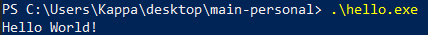

# asm-hello-world  
*(For Absolute Beginners!)*  
A beginner-friendly x64 Assembly 'Hello World' for Windows. Learn how to speak directly to the CPU!
Welcome to your first Assembly project! This guide will help you run a "Hello World" program on Windows x64.

## Quick Start  
**Just want to run it?** Follow these steps:  
1. **Install Tools**:  
   - [NASM](https://www.nasm.us/) (Assembler)  
   - [MinGW-w64](https://www.mingw-w64.org/) (Compiler)  

2. **Open PowerShell** in the project folder and run:  
```powershell
nasm -f win64 hello.asm -o hello.obj  # Convert to machine code
gcc hello.obj -o hello.exe -lkernel32 # Create executable
.\hello.exe                           # Run the program


## 📸 Screenshot  



 Project Files
File	Description
hello.asm	Assembly source code
hello.exe	Compiled program (generated)
LICENSE	MIT License - Free to use/modify
 Why This Code Works
For Curious Minds:

mov rcx, -11: Tells Windows to use the screen (-11 = magic number for output).

call WriteConsoleA: Uses Windows' built-in function to print text.

 Troubleshooting
Had an error? Common fixes:

 "nasm not found": Add NASM to PATH

 Linker errors: Add -lkernel32 to the GCC command

 No output: Check if hello.asm is in the same folder
